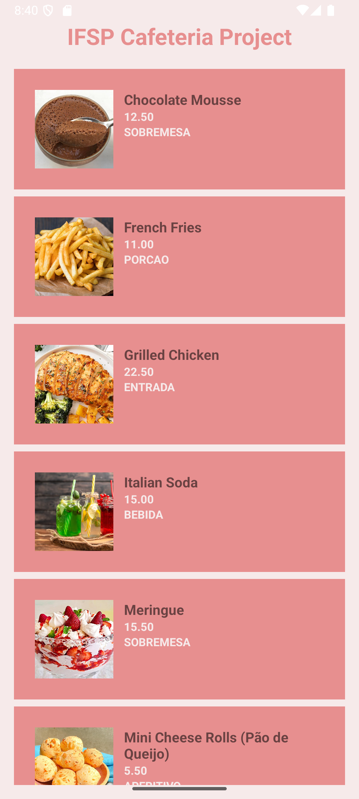
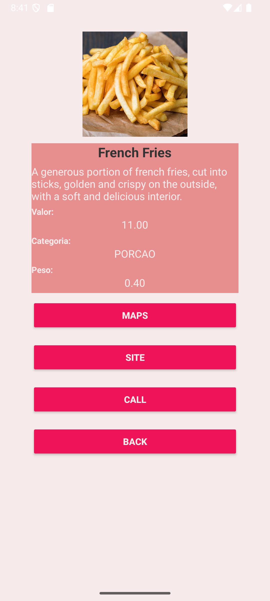
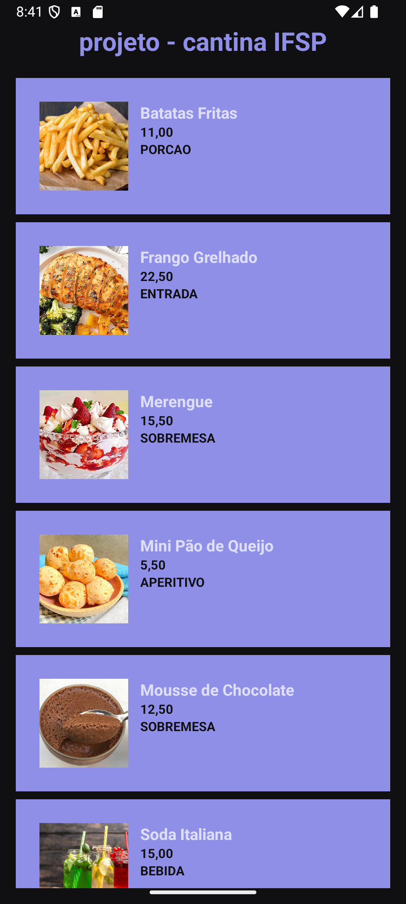
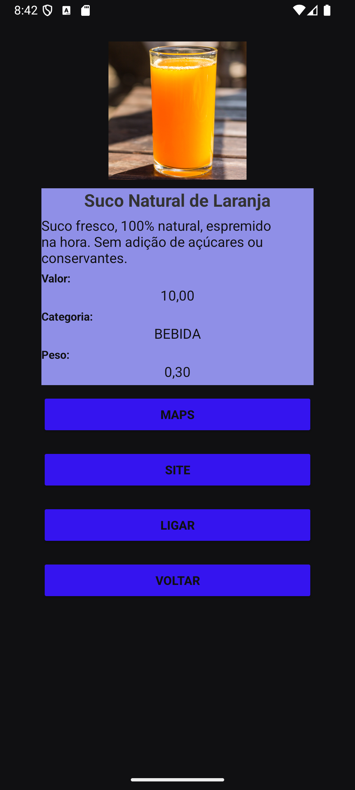

# 📱​ Projeto ARQDMO1 - Cantina IFSP
--- 
## 💻​ Proposta

Aplicativo desenvolvido em **Kotlin** a partir do **Android Studio**, é um projeto simples que ilustra o funcionamento de intents dentro do desenvolvimento **Mobile**. 
### O programa apresenta as seguintes funcionalidades: 
- List View com fotos e dados personalizados;
- Internacionalização, com Inglês e Português;
- Modo Dia e Noite;

--- 

## 🌞 Modo Dia/Claro 

  
  
  

## 🌚​ Modo Noite/Escuro

  
  
  

## 🎥 Vídeo Ilustrativo

